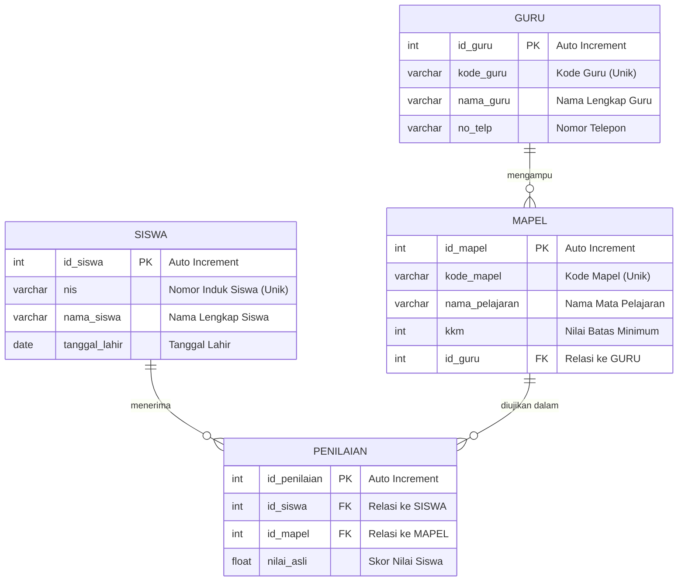

# LAPORAN UAS BASIS DATA
## PERANCANGAN DATABASE DAN APLIKASI CURD
### SISTEM INFORMASI AKADEMIK SEKOLAH

---

### A. Pemilihan Topik
Topik yang dipilih untuk pengerjaan tugas UAS Basis Data ini adalah **C. Sistem Informasi Akademik di Sekolah**. Sistem ini dirancang untuk menangani kebutuhan operasional akademik sekolah mulai dari pengelolaan data induk kesiswaan, inventarisasi tenaga pendidik (guru), manajemen kurikulum mata pelajaran, hingga proses rekapitulasi penilaian akhir ujian siswa beserta penentuan otomatis status kelulusan berdasarkan kriteria KKM.

---

### B. Proses Bisnis dan Penentuan Modul Sistem
Alur operasional akademik pada sistem ini didefinisikan ke dalam empat modul utama berikut:
1. **Modul Siswa (Kesiswaan):** Siswa baru didaftarkan ke dalam sistem dengan mencantumkan data pribadi (NIS, nama lengkap, tanggal lahir, dan alamat). Data ini disimpan ke dalam database untuk keperluan pelacakan rekam akademis selama masa sekolah.
2. **Modul Guru (Tenaga Pendidik):** Menginventarisasi data seluruh guru yang aktif mengajar di sekolah (ID Guru, nama lengkap, dan nomor telepon) untuk kemudian dipetakan sebagai penilai atau pengampu mata pelajaran tertentu.
3. **Modul Mata Pelajaran (Kurikulum):** Mengelola master data mata pelajaran yang tersedia di sekolah, meliputi ID mata pelajaran, nama pelajaran, serta ambang batas Nilai Kriteria Ketuntasan Minimal (KKM).
4. **Modul Penilaian (Akademik):** Guru memproses penginputan nilai asli yang diperoleh siswa. Sistem secara dinamis akan mencatat nilai tersebut, menampilkan guru yang memberikan nilai, serta menyajikan status kelulusan siswa secara otomatis.

---

### C. Aktor yang Terlibat dalam Tiap Modul
Pengguna sistem terbagi menjadi dua aktor utama:
1. **Siswa (Peserta Didik):** Aktor eksternal yang memberikan data pribadi untuk didaftarkan, mengikuti proses evaluasi pelajaran, serta menerima laporan rekapitulasi nilai akhir.
2. **Admin / Guru / Operator Sekolah:** Aktor internal yang memiliki hak akses untuk mengelola data master kesiswaan, memperbarui master mata pelajaran, memasukkan parameter KKM, menginput nilai asli siswa, serta menerbitkan laporan evaluasi belajar.

---

### D. Desain Entity Relationship Diagram (ERD)
Berikut adalah visualisasi rancangan database ERD relasional yang merepresentasikan struktur tabel fisik pada sistem akademik sekolah menggunakan sintaks Mermaid 

Deskripsi Entitas dan Atribut:
- Siswa (Master): Menyimpan data diri peserta didik. PK: id_siswa. Atribut: nis (unik), nama siswa, dan tanggal lahir.

- Guru (Master): Menyimpan data diri tenaga pendidik. PK: id_guru. Atribut: kode guru (unik), nama_guru, dan no telp.

- Mata Pelajaran (Master): Menyimpan daftar kurikulum pelajaran. PK: id_mapel. FK: id_guru. Atribut: kode_mapel (unik), nama_pelajaran, dan kkm.

- Penilaian (Transaksi Utama): Mencatat lembar evaluasi belajar. PK: id_penilaian. FK: id_siswa dan id_mapel. Atribut: nilai_asli.

---

### E. Penentuan Kardinalitas Relasi
- Relasi Data Internal ($1:M$): Satu kode id_mapel yang sama dapat muncul berkali-kali di dalam tabel penilaian karena diambil oleh banyak siswa yang berbeda.
- Relasi Penilai ($1:M$): Satu orang guru (dinilai_oleh) dapat melakukan penginputan nilai berkali-kali untuk banyak siswa dan mata pelajaran yang berbeda.

---

### F. Proses Normalisasi Database
Proses normalisasi dilakukan secara bertahap untuk menghilangkan redundansi data serta mencegah terjadinya anomali data (insert, update, delete anomaly).

a) Bentuk Tidak Ternormalisasi (UNF) & 1NF (First Normal Form)
Memastikan seluruh kolom bernilai atomik tunggal tanpa adanya repeating groups:

| Nama Kolom | Jenis Kunci | Keterangan |
|------------|-------------|------------|
| **id_penelitian** | Primary Key (PK) | ID unik rekam nilai |
| **nis** | - | Nomor Induk Siswa |
| **nama siswa** |	- | Nama lengkap siswa |
| **kode_mapel** |	- |	Kode unik mata pelajaran |
| **nama_pelajaran** | - |	Nama mata pelajaran |
| **kkm** |	- |	Standar kelulusan minimum |
| **nilai asli** |	- |	Nilai mentah hasil ujian siswa |
| **kode_guru**| - | Kode identitas guru |
| **nama guru** | - | Nama lengkap guru penilai |

b) Bentuk Normal Kedua (2NF)
Memecah tabel induk agar seluruh atribut non-key bergantung penuh secara fungsional (fully functionally dependent) pada Primary Key tabel masing-masing:

- Tabel Master Siswa: id_siswa (PK), nis, nama siswa, tanggal lahir.

- Tabel Master Guru: id_guru (PK), kode_guru, nama_guru, no_telp.

- Tabel Master Mapel: id_mapel (PK), id_guru (FK), kode_mapel, nama_pelajaran, kkm.

- Tabel Transaksi Penilaian: id_penilaian (PK), id_siswa (FK), id_mapel (FK), nilai_asli.

c) Bentuk Normal Ketiga (3NF)
Seluruh tabel hasil pecahan 2NF di atas telah memenuhi kriteria Bentuk Normal Ketiga (3NF) karena tidak lagi memiliki ketergantungan transitif (transitive dependency) di mana atribut non-key bergantung pada atribut non-key lainnya.
